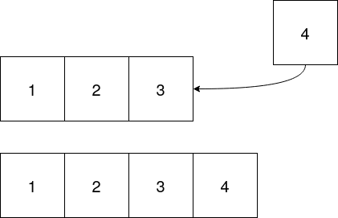
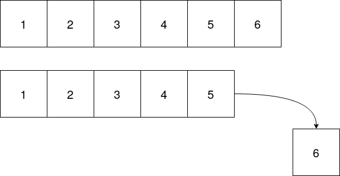
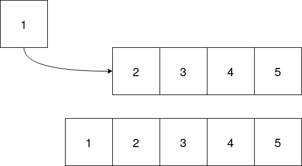
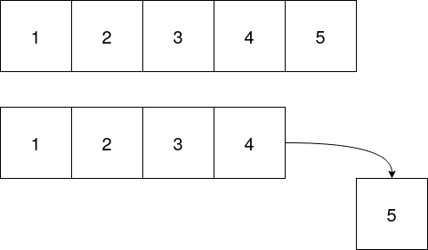

# FinalHomework
Homework on Stacks and Queues
## Objective
For the final homework you will be using `std::list` to implement a Queue in `GeneralQueue.hpp` and a Stack in `GeneralStack.hpp`. The method prototypes have been provided in the header files. Most of methods in the Queue and Stack classes will be calling the appropriate method from `std::list`. If you want to learn more about `std::list` [you can click here](https://www.cplusplus.com/reference/list/list/) or if you want an example online, [you can click here](https://en.cppreference.com/w/cpp/container/list). You should mostly be following the theory lectures for stacks and queues. **Do not use the lecture example with dynamic memory allocation, you will get a zero if you submit your code that way. Use std::list!**

## Std::list example
An example using std::list has been provided in the file `list_example.cpp`. All the code that is in that file should be everything you need to complete this homework. To see how to compile the program, please look at the next section.

## Makefile
A makefile has been provided to make compiling easier, so that you can compile `list_example.cpp` and `main.cpp` as separate programs. To compile `list_example.cpp` you must type:

    make list

and to clean the files associated with `list_example.cpp` you must type:

    make clean_list

Then to compile the homework you must either type:

    make

or

    make all

To clean the files associated with the homework you must type:

    make clean

Feel free to take a look at the file to see how things are implemented.

## Adding to a stack
To add a value to the stack, you must add to one end of the linked list, below is an example of adding to the end of a linked list.

## Removing from a stack
To remove a value from the stack, you must remove it from the end of the linked list where you add data. Below is an example.

## Adding to a queue
To add to a queue, you must choose one end to add data to. This can be the beginning or the end of a linked list.

## Removing from a queue
To remove data from a queue you must remove it from the other end in which you add data. If you add data to the front, you must remove from the back and vice versa.

# Rubric

| Requirement                  | Score  |
| :--------------------------: | :----: |
|------------------------------|--------|
| Implementation of Stack.hpp  |   25%  |
| Implementation of Queue.hpp  |   25%  |
| main.cpp runs without error  |   30%  |
| Clean code                   |   20%  |
|------------------------------|        |
| Total                        |  100%  |